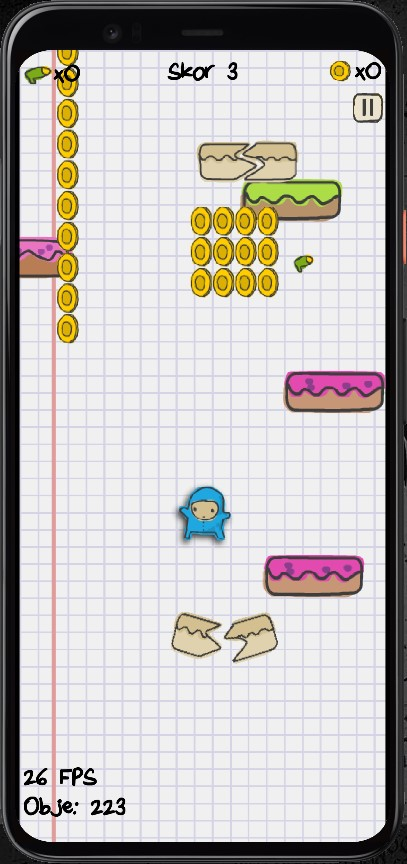
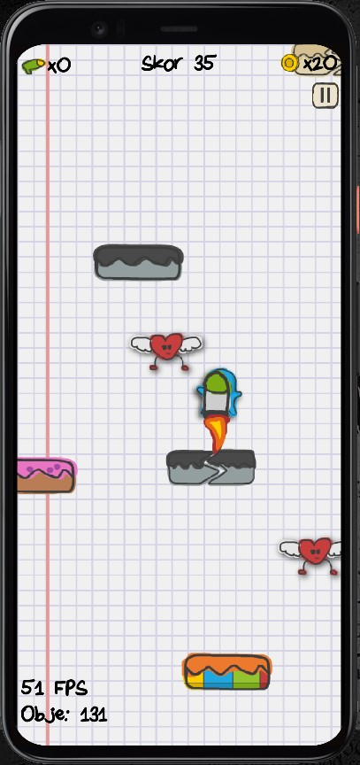

# Flying Super Baby ("Uçan Süper Bebek")

 

This game is Doodle Jump clone developed with Flutter.

# Screenshots

      

## Getting Started

1. Clone the repository:
   ```bash
   git clone https://github.com/osman-koc/superbaby-game.git
   ```
2. Navigate to the project directory:
   ```bash
   cd superbaby-game
   ```
3. Install dependencies:
   ```bash
   flutter pub get
   ```
4. Run the app:
   ```bash
   flutter run
   ```

## Acknowledgments

- Original repository: [flutter_games_compilation](https://github.com/Yayo-Arellano/flutter_games_compilation) by Yayo-Arellano
